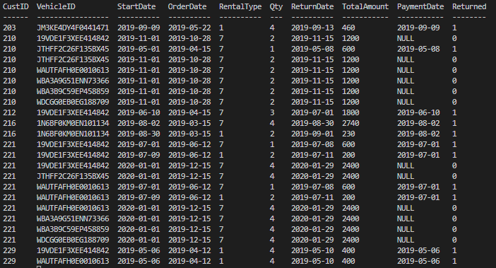

# Honor Code

I pledge, on my honor, to uphold UT Arlington's tradition of academic integrity, a tradition that values
hard work and honest effort in the pursuit of academic excellence.

I promise that I will submit only work that I personally create or that I contribute to group collaborations,
and I will appropriately reference any work from other sources. I will follow the highest standards of
integrity and uphold the spirit of the Honor Code.

## *[Subash Bhusal, Bishal Giri, Mubtasim Ahmed Rakheen]*

---
---

## Task 1:

### Query 1: Add an extra column 'Returned' to the RENTAL table. Values will be 0-for non returned cars, and 1-for returned cars. Then update the 'Returned' column with '1' for all records that they have a payment date and with '0' for those that they do not have a payment date.

```sql
ALTER TABLE RENTAL ADD COLUMN Returned INTEGER DEFAULT 0;
```
The we update the Rental Column
```sql
UPDATE RENTAL SET Returned = 1 WHERE PaymentDate <> 'NULL';
```



### Query 2: Create a view vRentalInfo that retrieves all information per rental. The view should have the following attributes:

- OrderDate
- StartDate
- ReturnDate  
- Total Days per Rental as 'TotalDays'
- Vehicle's ID as 'VIN'  
- Vehicle's Description as 'Vehicle'  
- Vehicle's Type as 'Type'
- Vehicle's Category as 'Category'  
- Customer's ID as 'CustomerID'  
- Customer's Name as 'CustomerName'  
- Order Total Amount as 'OrderAmount',  
- Order Remaining Amount as 'RentalBalance'

```sql
CREATE VIEW vRentalInfo AS
SELECT R.OrderDate, R.StartDate, R.ReturnDate, 
CAST(JULIANDAY(R.ReturnDate) - JULIANDAY(R.StartDate) AS INTEGER) AS TotalDays, 
R.VehicleId AS VIN, V.Description AS Vehicle, 
CASE V.Type
    WHEN 1 THEN 'Compact'
    WHEN 2 THEN 'Medium'
    WHEN 3 THEN 'Fullsize'
    WHEN 4 THEN 'SUV'
    WHEN 5 THEN 'Truck'
    WHEN 6 THEN 'Van'
END AS Type,
CASE V.Category
    WHEN 0 THEN 'Basic'
    WHEN 1 THEN 'Luxury'
END AS Category,
R.CustID AS CustomerID, C.Name AS CustomerName, R.TotalAmount AS OrderAmount,
CASE 
    WHEN R.PaymentDate = 'NULL' THEN R.TotalAmount
    WHEN R.PaymentDate <> 'NOT NULL' THEN 0
END AS RentalBalance
FROM RENTAL AS R JOIN VEHICLE AS V ON R.VehicleId = V.VehicleId
JOIN CUSTOMER AS C ON R.CustID = C.CustID
ORDER BY StartDate ASC;
```


```
sqlite> SELECT COUNT(ReturnDate) AS N_ROWS
   ...> FROM vRentalInfo;
N_ROWS
------
23

```


----